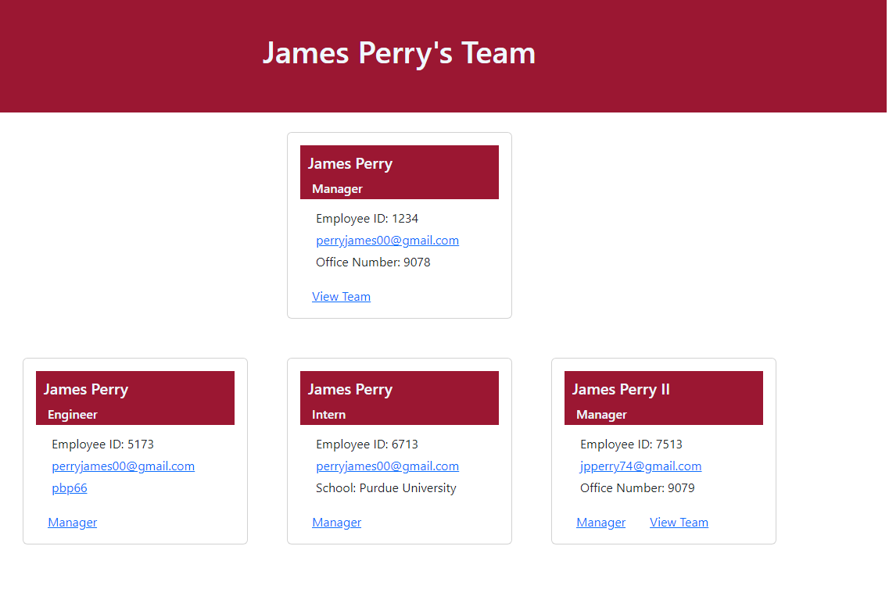
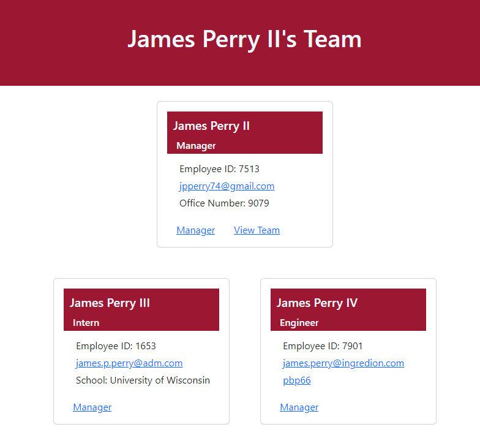

# Team Profile Generator

## Description

Uses a node.js CLI to prompt a user for team structure and generates a simple html webpage displaying the team and each of the member's profile information.

**User Story:**
As a manager, I want to generate a webpage that displays my team's basic info, so that I have quick access to their emails and GitHub profiles

**Acceptance Criteria:**
Given a command-line application that accepts user input, when I am prompted for my team members and their information. Then, an HTML file is generated that displays a nicely formatted team roster based on user input. When I click on an email address in the HTML, then my default email program opens and populates the TO field of the email with the address. When I click on the GitHub username, then that GitHub profile opens in a new tab. When I start the application, then I am prompted to enter the team manager’s name, employee ID, email address, and office number. When I enter the team manager’s name, employee ID, email address, and office number, then I am presented with a menu with the option to add an engineer or an intern or to finish building my team. When I select the engineer option, then I am prompted to enter the engineer’s name, ID, email, and GitHub username, and I am taken back to the menu. When I select the intern option, then I am prompted to enter the intern’s name, ID, email, and school, and I am taken back to the menu. When I decide to finish building my team, then I exit the application, and the HTML is generated.

The cool feature with this project is that the team is stored in a tree data-structure. This enabled the program to generate sub team recursively when needed. Additionally, I gained a little experience using the [JSDOM](https://www.npmjs.com/package/jsdom) package. The package made it incredibly simple to use the traditional DOM api in the nodeJS environment. 

## Table of Contents

1. [Installation](#installation)
2. [Usage](#usage)
3. [License](#license)
4. [Contribute](#contribute)
5. [Tests](#tests)
6. [Questions](#questions)

## Installation

From GitHub, clone the repository onto your local machine. Navigate to the install directory and run `npm install`. If npm is not installed, you will need to install it for your local machine first. After npm has installed the necessary modules, the program is ready to run.

## Usage

Navigate to the root directory of the project. Run `npm start` in the console to start the program. You will be prompted to enter the name, employee id, email and office number for the team manager. From there, you can add another manager, an engineer, an intern, or exit the program. Choosing an engineer or intern will add them to your team after completing their prompts. Choosing a manager will generate a new "sub" team to complete. When exiting a sub team, you will be returned to the "parent" team and be prompted to continue building that team or finish. Upon finishing, html websites will be generated in the dist folder. Look at the screenshots below for examples:

Final Webpage Template Views:

For a brief video walkthrough, use one of the below links:

[Youtube Link for the Video](# "Team Profile Generator Video Guide")

## License

MIT

Copyright (c) 2022 James Perry

Permission is hereby granted, free of charge, to any person obtaining a copy of this software and associated documentation files (the "Software"), to deal in the Software without restriction, including without limitation the rights to use, copy, modify, merge, publish, distribute, sublicense, and/or sell copies of the Software, and to permit persons to whom the Software is furnished to do so, subject to the following conditions:

The above copyright notice and this permission notice shall be included in all copies or substantial portions of the Software.

THE SOFTWARE IS PROVIDED "AS IS", WITHOUT WARRANTY OF ANY KIND, EXPRESS OR IMPLIED, INCLUDING BUT NOT LIMITED TO THE WARRANTIES OF MERCHANTABILITY, FITNESS FOR A PARTICULAR PURPOSE AND NONINFRINGEMENT. IN NO EVENT SHALL THE AUTHORS OR COPYRIGHT HOLDERS BE LIABLE FOR ANY CLAIM, DAMAGES OR OTHER LIABILITY, WHETHER IN AN ACTION OF CONTRACT, TORT OR OTHERWISE, ARISING FROM, OUT OF OR IN CONNECTION WITH THE SOFTWARE OR THE USE OR OTHER DEALINGS IN THE SOFTWARE.

## How to Contribute

Before contributing, be sure to read the GitHub [Code of Conduct](https://github.com/github/docs/blob/main/CODE_OF_CONDUCT.md). If you have an issue, search all open issues to see if one matches the description of your issue. If not, proceed to create one providing details on the issue, errors, OS, options provided, installed node packages, etc. Issues are not assigned to anyone by the repository team. To select an issue to work on, open a pull request and generate a new branch labeled as the issue. Add your name as a contributor to the issue in question. When you make the desired changes and fixes, push all changes to your branch on the repository and submit. The repository team will review the changes. If acceptable, we will merge the changes to main and we will notify you of a successful merge or any necessary changes before a merge can take place.

## Tests

Run `npm test` in the console to run tests.

## Questions

Repo owner: [pbp66](https://github.com/pbp66).
For any questions, you may contact pbp66 via email: perryjames00@gmail.com. Please format your email using the following template:

- Subject: Repository - Question/Issue
- Body: Summarize the issue with a brief description for the first paragraph. Additional paragraphs can be used for a long description, if needed. Include any errors when using this project
- Signature: Please leave an email address so that any updates are sent get back to you.

